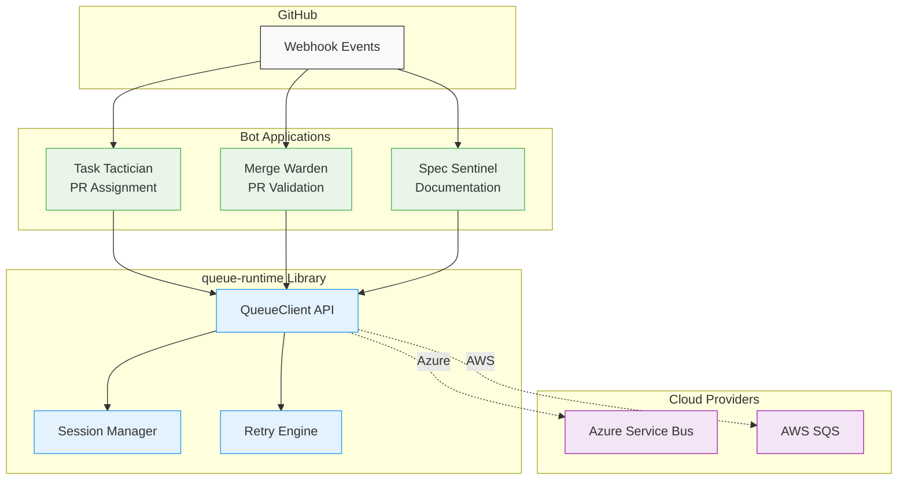

# Queue Runtime - Specification

**Version**: 1.0
**Last Updated**: January 2026
**Status**: Active Development

## Introduction

This specification defines the architecture, behavior, and implementation constraints for `queue-runtime`, a Rust library providing provider-agnostic abstractions over cloud message queue services (Azure Service Bus, AWS SQS).

**Purpose**: Enable GitHub bot applications to process webhook events reliably with consistent APIs, session-based ordering, and graceful error handling—regardless of the underlying cloud provider.

## Navigation

This specification is organized into focused documents, each addressing a specific architectural concern.

### Foundation Documents

Start here to understand the system context and establish common terminology:

- **[Overview](./overview.md)** - System context, problem statement, stakeholders, and success criteria
- **[Vocabulary](./vocabulary.md)** - Domain concepts and terminology used throughout the specification
- **[Architecture](./architecture.md)** - Logical boundaries, dependencies, and hexagonal architecture pattern
- **[MITM Protection Summary](./mitm-protection-summary.md)** - Man-in-the-middle attack prevention architecture (NEW)

### Design Decisions

These documents explain key architectural choices and their rationale:

- **[Tradeoffs](./tradeoffs.md)** - Analysis of alternatives considered and decisions made
- **[Responsibilities](./responsibilities.md)** - Component responsibilities using Responsibility-Driven Design (RDD)
- **[Constraints](./constraints.md)** - Implementation rules, type system requirements, and architectural boundaries

### Behavioral Specification

Define what the system must do:

- **[Assertions](./assertions.md)** - Testable behavioral specifications with given/when/then scenarios
- **[Edge Cases](./edge-cases.md)** - Non-standard flows, failure modes, and error scenarios

### Operational Concerns

How the library operates in production environments:

- **[Operations](./operations.md)** - Deployment, monitoring, scaling, and maintenance
- **[Security](./security.md)** - Threat model, security boundaries, and mitigation strategies

### Module Specifications

Detailed specifications for individual modules:

- **[Client](./modules/client.md)** - QueueClient trait and queue operations
- **[Messages](./modules/messages.md)** - Message types, serialization, and envelope format
- **[Sessions](./modules/sessions.md)** - Session management and ordering strategies
- **[Retry Logic](./modules/retry.md)** - Retry policies, backoff strategies, and circuit breakers
- **[Dead Letter Queue](./modules/dlq.md)** - DLQ handling and poison message detection
- **[Cryptography](./modules/cryptography.md)** - Message encryption and MITM protection (NEW)
- **[Azure Provider](./modules/azure.md)** - Azure Service Bus implementation
- **[AWS Provider](./modules/aws.md)** - AWS SQS implementation (planned)
- **[Observability](./modules/observability.md)** - Metrics, tracing, and logging
- **[Testing](./modules/testing.md)** - Test utilities and contract testing

### Supporting Documentation

- **[Queue Naming](./naming.md)** - Queue naming conventions and patterns
- **[Provider Comparison](./providers.md)** - Azure vs AWS feature comparison
- **[Performance](./performance.md)** - Performance optimization strategies

---

## Quick Reference

### Key Architectural Decisions

1. **Hexagonal Architecture**: Business logic depends on port abstractions, not concrete providers
2. **Provider Abstraction**: Common core + optional extensions (sessions)
3. **Session Strategy**: Pluggable algorithms for generating session IDs from message content
4. **Error Handling**: Common error enum with transient vs permanent classification
5. **Async Runtime**: Tokio-only (no runtime abstraction)
6. **Message Design**: Structured message with Bytes payload and metadata
7. **Configuration**: Serde-based structs supporting multiple config sources
8. **Testing**: In-memory provider + contract tests for behavioral consistency

See [Tradeoffs](./tradeoffs.md) for detailed analysis of each decision.

### Core Abstractions

**QueueClient**: Primary interface for queue operations (send, receive, complete, abandon)

**SessionClient**: Interface for session-based ordered message processing

**Provider Port**: Abstract interface that providers must implement

**QueueError**: Common error type with categories (transient, permanent, lock/session)

**Message**: Structured message with body (bytes), session ID, correlation ID, and properties

See [Vocabulary](./vocabulary.md) for complete terminology.

### Behavioral Guarantees

- **At-Least-Once Delivery**: Messages delivered at least once (duplicates possible)
- **Session Ordering**: FIFO delivery within a session
- **Session Exclusivity**: Only one consumer per session at a time
- **Automatic Retry**: Transient errors retried with exponential backoff
- **DLQ Integration**: Poison messages moved to DLQ after max attempts
- **Provider Portability**: Switch between Azure/AWS with configuration only

See [Assertions](./assertions.md) for testable specifications.

---

## Workflow for Readers

### For Architects

1. Read [Overview](./overview.md) for system context
2. Review [Architecture](./architecture.md) for logical boundaries
3. Study [Tradeoffs](./tradeoffs.md) to understand key decisions
4. Examine [Security](./security.md) for threat model

### For Developers

1. Start with [Vocabulary](./vocabulary.md) to learn terminology
2. Read [Architecture](./architecture.md) for component relationships
3. Check [Constraints](./constraints.md) for implementation rules
4. Review [Assertions](./assertions.md) for expected behavior
5. Consult module specs for detailed requirements

### For Operations Teams

1. Read [Overview](./overview.md) for system purpose
2. Study [Operations](./operations.md) for deployment and monitoring
3. Review [Security](./security.md) for credential management
4. Check [Edge Cases](./edge-cases.md) for failure scenarios

### For Testers

1. Review [Assertions](./assertions.md) for behavioral specifications
2. Study [Edge Cases](./edge-cases.md) for scenarios to test
3. Check [Testing module](./modules/testing.md) for test utilities
4. Review [Constraints](./constraints.md) for contract requirements

---

## Specification Principles

This specification follows these principles:

1. **Logical Focus**: Defines **what** and **why**, not **how** or **where**
2. **Implementation Agnostic**: Avoids prescribing file structures or naming (architect's job, not interface designer's)
3. **Testable**: All requirements expressed as testable assertions
4. **Traceable**: Clear links between decisions, constraints, and requirements
5. **Evolvable**: Living document that evolves with understanding
6. **Precise**: Uses domain terminology consistently (see Vocabulary)
7. **Complete**: Covers functional, operational, and security concerns

---

## System Architecture Diagram

See [Architecture](./architecture.md) for detailed architectural diagrams and dependency analysis.

---

## How to Use This Specification

### When Implementing

1. **Understand Context**: Read foundation documents first
2. **Follow Constraints**: Implementation must respect all constraints
3. **Pass Assertions**: All behavioral assertions must pass
4. **Handle Edge Cases**: Implementation must handle documented edge cases
5. **Reference Modules**: Use module specs for detailed requirements

### When Reviewing

1. **Check Traceability**: Verify implementation traces to specifications
2. **Validate Behavior**: Confirm assertions are tested
3. **Review Security**: Ensure security mitigations implemented
4. **Assess Performance**: Verify performance targets met

### When Extending

1. **Document Decisions**: Add new tradeoffs if significant choices made
2. **Update Vocabulary**: Add new domain concepts consistently
3. **Add Assertions**: Specify expected behavior for new features
4. **Consider Edge Cases**: Document new failure modes
5. **Update Architecture**: Reflect new boundaries or dependencies

---

## Feedback and Updates

This specification is a living document. When inconsistencies are found or clarifications needed:

1. **For Interface Designer**: Translate logical architecture into concrete types and interfaces
2. **For Planner**: Break down specifications into implementable tasks
3. **For Coder**: Implement according to constraints and assertions
4. **For Architect**: Update specifications based on implementation learnings

All updates should maintain traceability between documents and preserve the logical focus of the architecture.

---

## Version History

| Version | Date | Changes |
|---------|------|---------|
| 1.0 | January 2026 | Initial complete specification with all core documents |
| 0.9 | September 2025 | Initial draft with partial specifications |

---

## Contact and Governance

**Owner**: pvandervelde
**Repository**: <https://github.com/pvandervelde/queue-runtime>
**License**: Apache-2.0

For questions about this specification, please open an issue in the repository.
