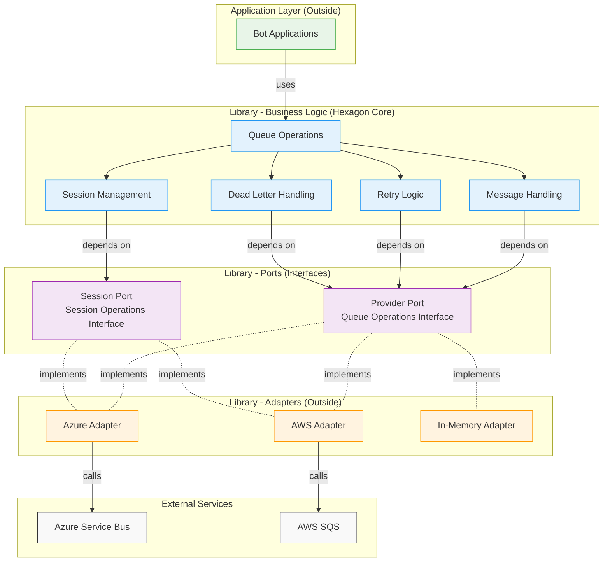

# Queue-Runtime Library Architecture

## Overview

The queue-runtime library applies **hexagonal architecture** (ports and adapters) to provide a provider-agnostic abstraction over cloud queue services. The architecture separates business logic (what the library does) from infrastructure concerns (how it connects to providers), enabling applications to switch between Azure Service Bus and AWS SQS without code changes.

## Architectural Principles

1. **Business Logic Independent**: Core queue operations independent of provider specifics
2. **Dependency Inversion**: Business logic depends on abstractions, not concrete providers
3. **Provider Abstraction**: Uniform interface hides provider differences
4. **Session Consistency**: Ordered processing works identically across providers
5. **Explicit Boundaries**: Clear separation between application, library core, and infrastructure

## Hexagonal Architecture Pattern



**Key Architectural Elements**:

- **Hexagon Core**: Business logic independent of providers (queue operations, sessions, retry, DLQ)
- **Ports**: Abstract interfaces defining operations needed by business logic
- **Adapters**: Provider-specific implementations of port interfaces
- **Dependency Direction**: Business logic → Ports ← Adapters (dependency inversion)

---

## Logical Component Boundaries

### Business Logic Layer (Core Hexagon)

**Purpose**: Implements provider-agnostic queue behavior and orchestration.

**Components**:

1. **Queue Operations**: Send, receive, complete, abandon, dead letter operations
2. **Session Management**: Session ID generation, session client lifecycle, FIFO ordering
3. **Message Handling**: Message structure, serialization helpers, metadata management
4. **Retry Logic**: Exponential backoff, error classification, circuit breaker
5. **Dead Letter Handling**: Poison message detection, DLQ routing, failure tracking

**Responsibilities**:

- Define queue operation semantics
- Coordinate message lifecycle
- Enforce session ordering constraints
- Manage retry policies and circuit breakers
- Track delivery counts and failure reasons

**NOT Responsible For**:

- Provider-specific API calls
- Connection management to cloud services
- Provider authentication details
- Physical message transport

**Dependencies**:

- Business logic depends only on **Port interfaces**
- NO direct dependencies on provider adapters
- NO imports of Azure SDK or AWS SDK

---

### Port Layer (Abstraction Interfaces)

**Purpose**: Define contracts that providers must implement.

**Ports Defined**:

1. **Provider Port**: Queue operations (send, receive, complete, abandon)
2. **Session Port**: Session operations (accept, receive, release)
3. **Configuration Port**: Provider configuration and initialization

**Key Abstractions**:

- **QueueClient**: Primary interface for queue operations
- **SessionClient**: Interface for session-based ordered processing
- **Provider Capabilities**: Enumeration of provider feature support (native vs emulated sessions)

**Responsibilities**:

- Define behavioral contracts for providers
- Specify error handling expectations
- Document session support semantics

**NOT Responsible For**:

- How providers implement operations
- Provider-specific features beyond core abstractions

---

### Adapter Layer (Provider Implementations)

**Purpose**: Implement port interfaces for specific cloud providers.

**Adapters**:

1. **Azure Service Bus Adapter**:
   - Implements ports using Azure Service Bus SDK
   - Native session support via Azure Service Bus sessions
   - Connection string and managed identity authentication

2. **AWS SQS Adapter**:
   - Implements ports using AWS SDK for Rust
   - Emulated sessions via FIFO queues and message groups
   - IAM role and access key authentication

3. **In-Memory Adapter**:
   - Implements ports using in-memory data structures
   - For testing and local development only
   - Simulates provider behaviors deterministically

**Responsibilities**:

- Map common operations to provider-specific APIs
- Handle provider authentication and connection management
- Translate provider errors to common error types
- Manage provider-specific resources (connections, senders, receivers)

**NOT Responsible For**:

- Business logic (retry, circuit breaking, DLQ decisions)
- Cross-provider orchestration
- Session ordering logic (enforced by provider or emulated)

---

## Dependency Relationships

### Dependency Flow Rules

**Rule 1: Business Logic → Ports (Abstraction)**

- Business logic components depend only on port traits
- NO imports of concrete provider adapters in business logic
- Enforced by module visibility and compilation

**Rule 2: Adapters → Ports (Implementation)**

- Adapters implement port traits
- Adapters may depend on provider SDKs
- Adapters MAY NOT depend on other adapters

**Rule 3: Application → Business Logic**

- Applications use business logic API (QueueClient trait)
- Applications configure provider selection at runtime
- Applications receive provider-agnostic errors

**Visualization**:

```
Application Layer
    ↓ (uses)
Business Logic (depends on ↓)
    ↓ (abstractions only)
Port Layer (implemented by ↓)
    ↓ (concrete implementations)
Adapter Layer
    ↓ (calls)
External Services (Azure/AWS)
```

### Module Organization Principle

The architecture defines **logical boundaries**, not physical file structure. Implementation will follow language-appropriate organization:

- **Rust**: Modules by domain concept (client, message, session, error, provider)
- **Logical layers**: Enforced through module visibility and trait bounds
- **No "ports" or "adapters" folders**: Use domain names, not architectural terms

---

## Session Abstraction Strategy

### Session Ordering Requirements

**Goal**: Guarantee FIFO delivery of related messages regardless of provider.

**Provider Capabilities**:

| Provider | Mechanism | Library Support |
|----------|-----------|-----------------|
| Azure Service Bus | Native sessions | Direct mapping to port |
| AWS SQS | FIFO queues + message groups | Session ID → message group |
| In-Memory | Internal ordering | Simulated with locks |

**Abstraction Approach**:

1. **Uniform Interface**: SessionClient trait works identically across providers
2. **Capability Detection**: Providers advertise native vs emulated session support
3. **Session Strategy**: Pluggable algorithm for generating session IDs from message content
4. **Lock Semantics**: Exclusive session access enforced by provider or emulated

**Session Lifecycle**:

```
1. Application provides SessionStrategy
2. Strategy generates session ID from message
3. Message sent with session ID
4. Consumer accepts session (blocks until available)
5. SessionClient provides ordered message delivery
6. Consumer completes or abandons session
7. Session becomes available for other consumers
```

---

## Error Boundary Design

### Error Categories

**Transient Errors** (should retry):

- `ConnectionFailed`: Network issues, temporary unavailability
- `Timeout`: Operation exceeded time limit
- `ServiceThrottled`: Rate limit or quota exceeded temporarily

**Permanent Errors** (should NOT retry):

- `QueueNotFound`: Queue does not exist
- `AuthenticationFailed`: Invalid credentials
- `AuthorizationFailed`: Insufficient permissions
- `MessageTooLarge`: Message exceeds size limit
- `InvalidMessage`: Malformed message structure

**Lock/Session Errors** (special handling):

- `InvalidReceipt`: Receipt handle invalid or expired
- `SessionLockLost`: Session lock expired, acquired by another consumer
- `SessionNotFound`: Requested session does not exist

**Error Mapping**:

Providers map their specific errors to common categories:

```
Azure Service Bus          →  Common Error
---------------------         --------------
EntityNotFoundException    →  QueueNotFound
UnauthorizedException      →  AuthenticationFailed
MessageLockLostException   →  InvalidReceipt
ServiceBusException        →  ConnectionFailed

AWS SQS                    →  Common Error
---------------------         --------------
QueueDoesNotExist          →  QueueNotFound
AccessDenied               →  AuthorizationFailed
ReceiptHandleIsInvalid     →  InvalidReceipt
RequestThrottled           →  ServiceThrottled
```

### Error Context Preservation

Each error includes:

- **Error category**: For retry decision logic
- **Context**: Queue name, message ID, operation type
- **Source**: Original provider error (for debugging)
- **Timestamp**: When error occurred

---

## Configuration Boundaries

### Configuration Responsibility

**Application Provides**:

- Provider selection (Azure or AWS)
- Provider-specific credentials and endpoints
- Queue names for operations
- Timeouts and retry policies

**Library Validates**:

- Configuration structure and required fields
- Credential format (not authentication itself)
- Timeout ranges and retry parameters

**Provider Adapters Handle**:

- Connection establishment with credentials
- Authentication with cloud services
- Connection pooling and lifecycle

### Configuration Sources

Applications can load configuration from:

1. Environment variables (12-factor app style)
2. Configuration files (TOML, YAML, JSON)
3. Secret management systems (Key Vault, Secrets Manager)
4. Programmatic construction (builder pattern)

Library provides configuration structs compatible with `serde` for deserialization.

---

## Testing Boundaries

### Test Responsibilities by Layer

**Business Logic Tests** (Unit):

- Use mock providers (test doubles for ports)
- Verify orchestration logic (retry, circuit breaker, DLQ routing)
- Fast, deterministic, no external dependencies
- 100% coverage goal

**Adapter Tests** (Integration):

- Test against real or emulated provider services
- Verify provider-specific behavior and error mapping
- May be slower, require infrastructure
- Verify contract compliance

**Contract Tests** (Specification):

- Define expected behavior for all providers
- Each adapter must pass identical contract tests
- Ensures behavioral consistency across providers
- Serves as executable specification

**Application Tests** (End-to-End):

- Use in-memory provider for fast tests
- Optionally test against real services in CI
- Verify application message handling logic

---

## Extension Points

### Adding New Providers

To add a new provider (e.g., RabbitMQ, Google Pub/Sub):

1. Implement `QueueProvider` port trait
2. Implement `SessionProvider` port trait (if sessions needed)
3. Map provider errors to common `QueueError` variants
4. Pass contract test suite
5. Document provider-specific configuration

**No Changes Required** to:

- Business logic layer
- Existing adapters
- Application code using the library

### Adding New Features

**Feature Addition Pattern**:

1. If feature needed across all providers:
   - Add to port trait
   - Update all adapters to implement
   - Add to contract test suite

2. If feature provider-specific:
   - Add as optional trait method with default implementation
   - Document capability detection
   - Adapters opt-in to advanced feature

**Example**: Lock extension

- Add `extend_lock()` to provider port with default error implementation
- Adapters supporting lock extension override method
- Applications check capability before using

---

## Performance Boundaries

### Performance Responsibilities

**Business Logic Layer**:

- Minimize overhead in orchestration
- Avoid unnecessary memory allocations
- Efficient retry backoff calculations

**Provider Adapters**:

- Connection pooling and reuse
- Batch operations where provider supports
- Efficient serialization/deserialization

**Applications**:

- Concurrent processing with appropriate parallelism
- Message handler performance
- Scaling consumer instances

### Performance Targets

| Metric | Target | Owner |
|--------|--------|-------|
| Send latency (p95) | < 200ms | Adapter + Provider |
| Receive latency (p95) | < 200ms | Adapter + Provider |
| Business logic overhead | < 10ms | Business Logic |
| Memory per message | < 10 KB | All layers |
| Throughput per instance | > 1000 msg/s | All layers |

---

## Security Boundaries

### Security Responsibility by Layer

**Application Layer**:

- Message content validation
- Sensitive data handling in payloads
- Webhook signature verification
- Message signing/encryption if needed

**Business Logic Layer**:

- Does NOT inspect message bodies for security
- Relies on adapters for transport security
- Propagates errors without exposing credentials

**Provider Adapters**:

- Secure credential management (no logging)
- TLS for all network communication
- Certificate validation
- Credential refresh handling

**External Services**:

- Authentication and authorization
- Encryption at rest and in transit
- Access control to queues

---

## Summary: Architectural Boundaries

| Boundary | Inward (Depends On) | Outward (Depended On By) |
|----------|---------------------|--------------------------|
| **Application** | Business Logic API | Nothing (consumer of library) |
| **Business Logic** | Port abstractions only | Application |
| **Ports** | Nothing (pure interfaces) | Business Logic, Adapters |
| **Adapters** | Ports, Provider SDKs | Port implementations |
| **Providers** | Nothing (external services) | Adapters |

**Key Insight**: Business logic is the center, depending only on abstractions. Adapters are at the edges, knowing about both abstractions and concrete providers. This enables easy provider addition and testing without changing core logic.
