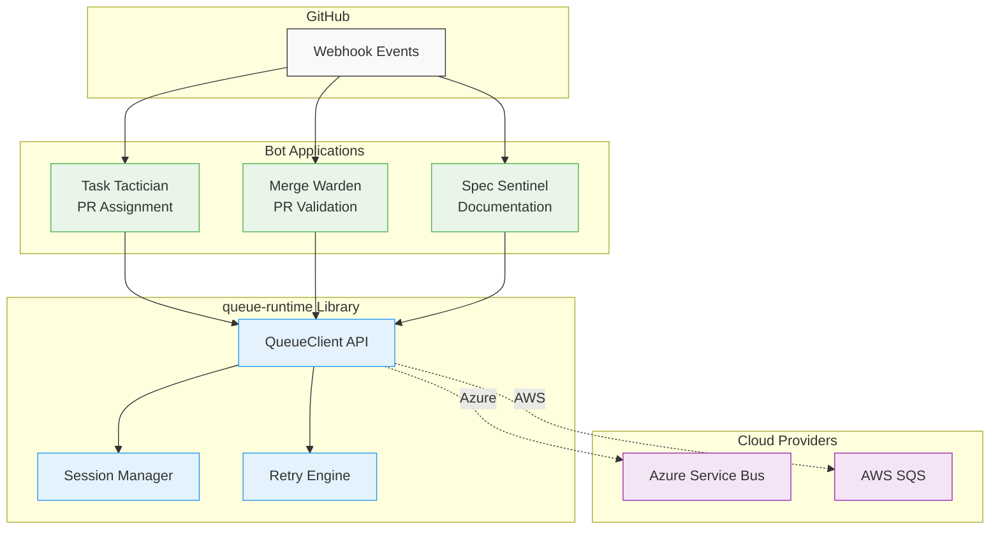

# Queue Runtime - System Overview

**Version**: 1.0
**Status**: Active Development
**Last Updated**: January 2026

## Purpose

The `queue-runtime` library provides a **provider-agnostic abstraction** over cloud message queue services, enabling applications (particularly GitHub bots) to process events reliably and consistently regardless of whether the underlying infrastructure uses Azure Service Bus or AWS SQS.

## Problem Statement

Services need to:

- Process webhook events reliably with at-least-once delivery guarantees
- Maintain strict ordering for related events (e.g., all events for a single pull request)
- Handle failures gracefully with retry and dead letter queue support
- Deploy flexibly across different cloud providers without code changes
- Scale to handle high-throughput event streams (1000+ messages/second)

Current solutions require:

- Writing provider-specific code for each cloud platform
- Managing different APIs, error handling patterns, and configuration approaches
- Implementing session/ordering semantics differently per provider
- Maintaining separate codebases or complex abstraction layers

## Solution Approach

`queue-runtime` solves these problems by:

1. **Unified API**: Single `QueueClient` trait that works identically across Azure and AWS
2. **Session Abstraction**: Consistent session-based ordering regardless of native provider support
3. **Error Normalization**: Common error types and retry strategies across providers
4. **Type Safety**: Strongly-typed message handling with compile-time guarantees
5. **Runtime Selection**: Provider choice configured at runtime, not compile time

## System Context

## Key Stakeholders

### Primary Users

- **Bot Developers**: Engineers building GitHub automation bots
- **DevOps Engineers**: Teams deploying bots across different cloud environments
- **Platform Engineers**: Infrastructure teams managing message queue resources

### Secondary Users

- **Security Teams**: Requiring credential management and audit trails
- **Operations Teams**: Monitoring queue health and message flow
- **Support Engineers**: Diagnosing message processing issues

## Core Capabilities

### Message Operations

- **Send**: Enqueue messages with metadata, session IDs, and scheduling
- **Receive**: Dequeue messages with timeout and batch controls
- **Complete**: Acknowledge successful processing and remove from queue
- **Abandon**: Return message to queue for reprocessing
- **Dead Letter**: Move permanently failed messages to DLQ

### Session Management

- **Ordered Processing**: Guarantees FIFO delivery within a session
- **Session Locking**: Prevents concurrent processing of same session
- **Session Strategies**: Configurable algorithms for session ID generation
- **Graceful Degradation**: Emulates sessions on providers without native support

### Resilience Features

- **Automatic Retry**: Exponential backoff with jitter for transient failures
- **Circuit Breaking**: Stops processing when downstream systems fail
- **Poison Message Detection**: Identifies and quarantines problematic messages
- **DLQ Integration**: Preserves failed messages for analysis and replay

### Configuration

- **Runtime Provider Selection**: Choose Azure or AWS via configuration
- **Environment-Based Config**: Load settings from environment variables or files
- **Credential Management**: Support managed identities, service principals, IAM roles
- **Sensible Defaults**: Works out-of-box with minimal configuration

## Non-Goals

This library explicitly does **not**:

- Provide message routing or pub/sub capabilities (use provider features directly)
- Implement message transformation or content inspection (application responsibility)
- Manage queue provisioning or infrastructure deployment (use IaC tools)
- Support local/embedded queues for production use (in-memory provider is test-only)
- Abstract all provider-specific features (only common queue operations)

## Constraints and Assumptions

### Technical Constraints

- **Rust Ecosystem**: Library targets Rust applications using tokio async runtime
- **Cloud-Only**: Designed for Azure and AWS, not on-premises message brokers
- **Queue Model**: Assumes point-to-point messaging, not topic/subscription patterns
- **Session Semantics**: Ordering limited to single-session scope, not global

### Operational Assumptions

- **Network Reliability**: Assumes stable network connectivity to cloud services
- **Credential Availability**: Assumes valid credentials configured before use
- **Queue Pre-existence**: Queues must be created before client usage (no auto-creation)
- **Single Region**: Does not handle cross-region replication or failover

### Performance Assumptions

- **Message Size**: Optimized for messages under 256KB (GitHub webhook typical size)
- **Throughput**: Designed for 100-10,000 messages/second per queue
- **Latency**: Targets p95 latency under 200ms for send/receive operations
- **Concurrency**: Supports 10-100 concurrent consumers per queue

## Glossary

### Queue Terminology

**Queue**: A named message buffer that provides reliable, asynchronous delivery between producers and consumers.

**Message**: A unit of data sent through a queue, containing a body (bytes) and metadata (properties).

**Session**: A logical grouping of related messages that must be processed in FIFO order.

**Receipt Handle**: An opaque token that proves ownership of a received message and enables acknowledgment operations.

**Dead Letter Queue (DLQ)**: A special queue for messages that cannot be processed successfully after retry attempts.

### Provider Terminology

**Azure Service Bus**: Microsoft's fully managed enterprise message broker with native session support.

**AWS SQS**: Amazon's fully managed message queuing service with FIFO queue support.

**Message Group**: AWS SQS concept equivalent to sessions, used for ordering guarantees.

**Visibility Timeout**: Duration a received message is hidden from other consumers (AWS SQS term).

**Lock Duration**: Duration a consumer holds exclusive access to a message (Azure Service Bus term).

### Domain Terminology

**Bot**: An automated application that responds to GitHub webhook events.

**Event**: A GitHub webhook payload representing an action in a repository.

**Envelope**: A standardized message wrapper containing event metadata and routing information.

**Provider**: A cloud platform implementation of the queue abstraction (Azure or AWS).

**Session Strategy**: An algorithm for generating session IDs from message content.

## Architecture References

This overview provides context for understanding the detailed architecture:

- [Architecture](./architecture.md) - Logical boundaries and dependencies
- [Vocabulary](./vocabulary.md) - Domain concepts and definitions
- [Responsibilities](./responsibilities.md) - Component roles and collaborations
- [Constraints](./constraints.md) - Implementation rules and boundaries
- [Assertions](./assertions.md) - Behavioral specifications

## Success Criteria

The library succeeds when:

1. **Portability**: Bots can switch between Azure and AWS with only configuration changes
2. **Reliability**: Messages are never lost and processed at-least-once with proper error handling
3. **Ordering**: Session-based messages are processed in strict FIFO order within each session
4. **Performance**: Meets throughput (1000 msg/s) and latency (p95 < 200ms) targets
5. **Maintainability**: Adding new providers requires minimal changes to existing code
6. **Usability**: Developers can integrate the library in under 30 minutes
