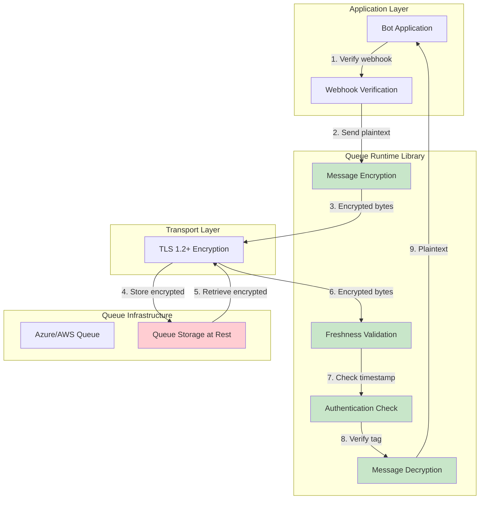

# Queue Runtime - Security Considerations

## Overview

This document analyzes security threats and mitigations for applications using queue-runtime. While the library itself is a component within applications, it interacts with cloud services and handles potentially sensitive data, requiring careful security considerations.

---

## Threat Model

### Assets to Protect

1. **Credentials**: Connection strings, IAM credentials, API keys
2. **Message Data**: GitHub webhook payloads, event data, metadata
3. **Queue Infrastructure**: Queue resources, namespaces, accounts
4. **Application Availability**: Bot uptime and reliability
5. **Audit Trail**: Logs showing message processing history

### Threat Actors

1. **External Attackers**: Attempting unauthorized access to queues or messages
2. **Malicious Insiders**: Users with legitimate credentials attempting unauthorized actions
3. **Compromised Applications**: Bot applications with vulnerabilities exploited by attackers
4. **Supply Chain Attacks**: Compromised dependencies or build processes

### Attack Vectors

1. Credential theft from environment variables, logs, or configuration files
2. Message injection or tampering in transit
3. Denial of service through queue flooding or resource exhaustion
4. Information disclosure through logs or error messages
5. Privilege escalation through misconfigured IAM policies

---

## Threat Analysis and Mitigations

### Threat 1: Credential Exposure

**Description**: Connection strings or credentials leaked through logs, error messages, or configuration files.

**Risk Level**: **CRITICAL**

**Attack Scenarios**:

- Credentials accidentally committed to version control
- Connection strings logged during debugging
- Error messages containing credentials shown to users
- Configuration files with credentials readable by unauthorized processes

**Mitigations**:

1. **Never Log Credentials**:
   - Library MUST NOT log connection strings, API keys, or tokens
   - Error messages MUST NOT include sensitive credential information
   - Debug logs MUST redact sensitive fields

2. **Use Secret Management**:
   - Store credentials in Azure Key Vault, AWS Secrets Manager, or HashiCorp Vault
   - Load secrets at application startup from secret management system
   - Rotate secrets regularly (every 90 days recommended)

3. **Prefer Managed Identities / IAM Roles**:
   - Azure: Use Managed Identity instead of connection strings where possible
   - AWS: Use IAM roles for EC2/ECS/Lambda instead of access keys
   - Eliminates need to handle credentials in application code

4. **Configuration Validation**:
   - Validate credentials at startup before processing messages
   - Fail fast if credentials are invalid or expired
   - Monitor for authentication failures

**Implementation in queue-runtime**:

```rust
// Connection strings marked with `#[serde(skip_serializing)]`
// Debug implementation redacts sensitive fields
impl Debug for QueueRuntimeConfig {
    fn fmt(&self, f: &mut Formatter<'_>) -> fmt::Result {
        f.debug_struct("QueueRuntimeConfig")
            .field("provider", &"<redacted>")
            .field("timeouts", &self.timeouts)
            .finish()
    }
}
```

---

### Threat 2: Message Tampering and Man-in-the-Middle Attacks

**Description**: Attackers with access to queue infrastructure intercept, read, modify, or replay messages between sender and receiver.

**Risk Level**: **CRITICAL**

**Attack Scenarios**:

1. **Message Eavesdropping**: Attacker with queue read access views sensitive webhook payloads (private repository data, tokens, user information)
2. **Message Modification**: Attacker modifies message content after send but before receive (e.g., changing PR number, repository name, or action type)
3. **Message Injection**: Attacker crafts and inserts malicious messages that appear legitimate
4. **Replay Attacks**: Attacker resends old valid messages to trigger duplicate or outdated actions
5. **Substitution Attacks**: Attacker replaces entire message with different encrypted message

**Threat Model**:

- **Attacker Capabilities**: Read/write access to queue storage, ability to intercept messages in queue
- **Assets at Risk**: Private repository data, webhook payloads, application logic integrity
- **Attack Surface**: Messages at rest in queue, messages during provider internal processing

**Mitigations**:

#### 1. **End-to-End Message Encryption**

**Purpose**: Prevent eavesdropping by encrypting message bodies end-to-end, even if queue infrastructure is compromised.

**Implementation**:

- Use authenticated encryption (AES-256-GCM) for all message bodies
- Encryption keys managed by application (not queue provider)
- Automatic encryption on send, decryption on receive
- See [cryptography module specification](./modules/cryptography.md) for complete design

**Configuration**:

```rust
use queue_runtime::{QueueClientBuilder, CryptoConfig};

let client = QueueClientBuilder::new()
    .with_azure_provider(config)
    .with_crypto(CryptoConfig {
        enabled: true,
        max_message_age: Duration::from_secs(300), // 5 minute freshness
        validate_freshness: true,
        ..Default::default()
    })
    .with_key_provider(key_provider)
    .build()
    .await?;
```

**Benefits**:

- Confidentiality: Message content unreadable without encryption key
- Integrity: Authentication tag prevents undetected modification
- Authenticity: Only parties with correct key can create valid messages
- Defense in depth: Protection even if TLS or queue access controls fail

#### 2. **Transport Security**

**Purpose**: Protect messages in transit between application and queue service.

**Implementation**:

- All connections to Azure Service Bus and AWS SQS use TLS 1.2+
- Certificate validation enabled by default
- No support for plaintext connections
- HTTPS endpoints only

**Limitations**: Only protects network transit, not storage at rest or provider-internal access.

#### 3. **Message Authentication Tags**

**Purpose**: Detect message tampering through cryptographic verification.

**Implementation**:

- AES-256-GCM produces 128-bit authentication tag for each message
- Tag verified during decryption before returning plaintext
- Includes message ID and session ID in authenticated associated data
- Tampering detection guaranteed with high confidence

**Behavior**:

```rust
// Automatic authentication on receive
let received = client.receive().await?;

// If authentication fails (message tampered):
// Error: CryptoError::AuthenticationFailed
```

#### 4. **Replay Protection**

**Purpose**: Prevent old valid messages from being replayed.

**Implementation**:

**Timestamp-Based Freshness** (Default):

- Each encrypted message includes encryption timestamp
- Configurable maximum message age (default: 5 minutes)
- Messages older than threshold rejected automatically

```rust
let config = CryptoConfig {
    max_message_age: Duration::from_secs(300),
    validate_freshness: true,
    ..Default::default()
};
```

**Nonce Tracking** (High Security):

- Track used nonces in cache/database
- Reject messages with reused nonces
- Opt-in for scenarios requiring strongest replay protection

```rust
let config = CryptoConfig {
    track_nonces: true,
    nonce_cache_ttl: Duration::from_secs(600),
    ..Default::default()
};
```

**Trade-offs**:

- Freshness: Simple, no storage, but allows replays within window
- Nonce tracking: Strongest protection, but requires stateful storage

#### 5. **Correlation IDs and Audit Trails**

**Purpose**: Enable detection of suspicious message patterns.

**Implementation**:

- Use correlation IDs to track message flow
- Log message IDs with all operations (send, receive, complete)
- Monitor for duplicate message IDs or unusual patterns
- Correlation ID in authenticated associated data (prevents substitution)

**Example**:

```rust
let msg = Message::builder()
    .with_body(payload)
    .with_correlation_id(request_id)
    .build();

// Correlation ID logged but message body encrypted
tracing::info!(
    correlation_id = %msg.correlation_id(),
    message_id = %msg.id(),
    "Message sent"
);
```

#### 6. **Source Authentication**

**Purpose**: Verify messages originate from trusted sources.

**Implementation**:

- GitHub webhooks include signatures (X-Hub-Signature-256)
- Verify webhook signatures **before** enqueuing messages
- Only accept messages from authenticated sources
- Webhook verification remains application responsibility (before queue library)

```rust
// Application code (before sending to queue)
fn verify_github_webhook(payload: &[u8], signature: &str, secret: &[u8]) -> bool {
    let computed = hmac_sha256(secret, payload);
    constant_time_compare(&computed, signature)
}

if verify_github_webhook(&payload, &signature, &webhook_secret) {
    queue_client.send(message).await?;
} else {
    return Err("Invalid webhook signature");
}
```

---

### Security Architecture Layers



**Defense in Depth**:

1. **Application**: Webhook signature verification
2. **Library**: End-to-end encryption + authentication
3. **Transport**: TLS for network transit
4. **Provider**: Queue access controls and network isolation

**Key Insight**: Even if transport (TLS) or infrastructure (queue access) is compromised, message content remains protected through end-to-end encryption.

---

### Key Management Requirements

**Application Responsibilities**:

1. **Key Storage**:
   - Store encryption keys in secure secret management system (Azure Key Vault, AWS Secrets Manager)
   - Never commit keys to source control
   - Use separate keys per environment (dev, staging, prod)

2. **Key Rotation**:
   - Rotate encryption keys every 90 days (recommended)
   - Use multi-key support during rotation (no downtime)
   - Remove old keys after queue TTL expires

3. **Access Control**:
   - Restrict key access to authorized services only
   - Use managed identities/IAM roles instead of connection strings
   - Audit key access patterns

**Library Responsibilities**:

1. **Key Protection**:
   - Zero key material from memory on drop
   - Never log or expose keys in error messages
   - Redact keys in Debug implementations

2. **Key Provider Interface**:
   - Abstract interface for key retrieval
   - Support multiple active keys (rotation)
   - Async key loading from secret stores

See [cryptography module](./modules/cryptography.md) for complete key management design.

---

### Threat 3: Unauthorized Queue Access

**Description**: Unauthorized users or applications access queues to read, modify, or delete messages.

**Risk Level**: **HIGH**

**Attack Scenarios**:

- Stolen credentials used to access production queues
- Overly permissive IAM policies allow unintended access
- Shared credentials between environments (dev accessing prod)
- Lateral movement from compromised application to queue resources

**Mitigations**:

1. **Principle of Least Privilege**:
   - Grant only minimum required permissions to each application
   - Azure: Specific queue permissions (Send, Receive, Manage)
   - AWS: SQS policy limiting actions to specific queues
   - Separate credentials per environment (dev, staging, prod)

2. **Network Isolation**:
   - Use private endpoints / VPC endpoints where possible
   - Restrict queue access to specific VNets or VPCs
   - Implement firewall rules limiting access to known IP ranges

3. **Audit Logging**:
   - Enable Azure Service Bus diagnostic logs
   - Enable AWS CloudTrail for SQS operations
   - Monitor for unusual access patterns (time of day, source IP, operation type)
   - Alert on unauthorized access attempts

4. **Credential Rotation**:
   - Rotate credentials regularly (every 90 days)
   - Automate rotation using secret management systems
   - Revoke compromised credentials immediately

**Azure Service Bus Policy Example**:

```json
{
  "rights": ["Send", "Listen"],
  "keyName": "bot-task-tactician",
  "queues": ["prod-task-tactician"]
}
```

**AWS SQS Policy Example**:

```json
{
  "Version": "2012-10-17",
  "Statement": [{
    "Effect": "Allow",
    "Action": [
      "sqs:SendMessage",
      "sqs:ReceiveMessage",
      "sqs:DeleteMessage"
    ],
    "Resource": "arn:aws:sqs:us-west-2:123456789012:prod-task-tactician"
  }]
}
```

---

### Threat 4: Denial of Service

**Description**: Attackers flood queues with messages or exhaust resources to disrupt bot operations.

**Risk Level**: **MEDIUM**

**Attack Scenarios**:

- Queue flooded with millions of messages, overwhelming consumers
- Messages with large payloads exhaust storage quotas
- Poison messages cause consumer crashes in tight loop
- Slowloris-style attacks keep sessions locked indefinitely

**Mitigations**:

1. **Rate Limiting**:
   - Implement rate limiting on GitHub webhook endpoints
   - Use cloud provider rate limiting features (API Gateway, Azure API Management)
   - Set maximum message size limits (256 KB recommended)

2. **Queue Quotas**:
   - Configure maximum queue depth limits
   - Set message TTL to prevent indefinite accumulation
   - Monitor queue depth and alert on unusual growth

3. **Poison Message Detection**:
   - Detect messages failing repeatedly (delivery count)
   - Move to DLQ after N attempts (3-5 recommended)
   - Circuit breaker pattern stops processing during cascading failures

4. **Resource Limits**:
   - Set connection limits to prevent resource exhaustion
   - Limit concurrent session processing
   - Configure memory limits for message processing

5. **Input Validation**:
   - Validate message format before processing
   - Reject malformed messages immediately
   - Set maximum message body size

**Implementation in queue-runtime**:

```rust
// Automatic poison message detection
if received_msg.delivery_count > config.max_delivery_count {
    client.dead_letter_message(
        receipt,
        "DeliveryCountExceeded",
        "Message failed processing after max attempts"
    ).await?;
}
```

---

### Threat 5: Information Disclosure

**Description**: Sensitive information leaked through logs, metrics, error messages, or DLQ messages.

**Risk Level**: **MEDIUM**

**Attack Scenarios**:

- GitHub personal access tokens logged in message bodies
- User email addresses or personal data in logs
- Error messages revealing internal system details
- DLQ messages accessible without proper authorization

**Mitigations**:

1. **Log Sanitization**:
   - Never log full message bodies (may contain tokens, keys)
   - Log only message IDs and metadata
   - Redact sensitive fields in structured logs
   - Use separate secure audit logs for compliance

2. **Error Message Hygiene**:
   - Generic error messages for external users
   - Detailed errors logged internally only
   - No stack traces or internal paths in error responses

3. **DLQ Access Control**:
   - Restrict DLQ access to authorized personnel only
   - Use separate credentials for DLQ operations
   - Encrypt DLQ messages at rest
   - Audit DLQ access

4. **Metric Privacy**:
   - Aggregate metrics without message content
   - Use message ID hashes instead of plaintext IDs
   - Avoid high-cardinality labels that could expose data

**Safe Logging Example**:

```rust
// SAFE - Only logs metadata
info!(
    message_id = %msg.message_id(),
    session_id = ?msg.session_id(),
    delivery_count = msg.delivery_count(),
    "Message received from queue"
);

// UNSAFE - Logs full body
// error!("Failed to process message: {:?}", msg);  // DON'T DO THIS
```

---

### Threat 6: Dependency Vulnerabilities

**Description**: Security vulnerabilities in queue-runtime dependencies (Azure SDK, AWS SDK, tokio, etc.) exploited by attackers.

**Risk Level**: **MEDIUM**

**Attack Scenarios**:

- Known CVE in Azure SDK allows remote code execution
- Transitive dependency with vulnerability
- Supply chain attack compromises dependency

**Mitigations**:

1. **Dependency Scanning**:
   - Use `cargo audit` to check for known vulnerabilities
   - Use `cargo deny` to enforce security policies
   - Run automated security scans in CI/CD pipeline
   - Review security advisories for dependencies

2. **Dependency Pinning**:
   - Pin major versions of dependencies in Cargo.toml
   - Use `Cargo.lock` for reproducible builds
   - Review dependency updates before upgrading

3. **Minimal Dependencies**:
   - Avoid unnecessary dependencies
   - Prefer well-maintained crates from trusted sources
   - Review transitive dependencies periodically

4. **Update Strategy**:
   - Apply security patches promptly (within 7 days)
   - Subscribe to security mailing lists for critical dependencies
   - Test updates in staging before production

**Cargo.toml Security Configuration**:

```toml
[dependencies]
azure_messaging_servicebus = "0.21"  # Pin major version
tokio = { version = "1.40", features = ["rt-multi-thread"] }

# Enable cargo-audit in CI
[dev-dependencies]
cargo-audit = "0.20"
```

---

## Security Best Practices

### For Library Developers

1. **Input Validation**:
   - Validate all configuration inputs
   - Sanitize queue names and message properties
   - Reject invalid message formats early

2. **Error Handling**:
   - Never expose internal details in error messages
   - Log detailed errors internally, return generic errors externally
   - Include context for debugging without sensitive data

3. **Secure Defaults**:
   - TLS enabled by default (no opt-out)
   - Certificate validation enabled
   - Reasonable timeout values
   - Secure credential handling

4. **Testing**:
   - Security tests for credential redaction
   - Tests for error message sanitization
   - Fuzzing tests for input validation
   - Integration tests with least-privilege credentials

### For Application Developers

1. **Credential Management**:
   - Use managed identities / IAM roles wherever possible
   - Store credentials in secret management systems
   - Rotate credentials regularly
   - Never commit credentials to version control

2. **Message Security**:
   - Validate message sources (verify GitHub webhook signatures)
   - Sign sensitive messages
   - Encrypt sensitive data in messages if required
   - Validate message content before processing

3. **Monitoring**:
   - Monitor for authentication failures
   - Alert on unusual access patterns
   - Track DLQ growth for security issues
   - Review audit logs regularly

4. **Least Privilege**:
   - Grant minimum required queue permissions
   - Separate credentials per environment
   - Use different credentials for different bots
   - Audit permissions regularly

---

## Compliance Considerations

### Data Residency

**Azure Service Bus**:

- Messages stored in specific Azure region
- No cross-region replication by default
- Geo-disaster recovery available (replicates metadata, not messages)

**AWS SQS**:

- Messages stored in specific AWS region
- No automatic cross-region replication
- Applications must handle regional failover

**Implications**:

- Choose regions that comply with data residency requirements (GDPR, etc.)
- Document data storage locations for compliance

### Data Retention

**Queue Messages**:

- Messages are transient (deleted after processing)
- DLQ messages may be retained longer (configure TTL appropriately)
- No automatic long-term retention

**Logging**:

- Logs may contain message metadata (not bodies)
- Configure log retention based on compliance requirements
- Consider separate secure audit logs for compliance

### Encryption

**In Transit**:

- All connections use TLS 1.2+ (enforced by library)
- No plaintext communication supported

**At Rest**:

- Azure Service Bus: Encryption at rest enabled by default (Microsoft-managed keys)
- AWS SQS: Server-side encryption available (SSE-SQS or SSE-KMS)
- Applications should enable encryption for their deployment

**Key Management**:

- Use cloud provider key management (Azure Key Vault, AWS KMS)
- Rotate encryption keys regularly
- Audit key access

---

## Incident Response

### Security Incident Procedure

1. **Detection**: Monitor alerts for security anomalies
2. **Containment**: Revoke compromised credentials immediately
3. **Investigation**: Review audit logs to determine scope
4. **Remediation**: Rotate all potentially affected credentials
5. **Recovery**: Restore normal operations with new credentials
6. **Post-Mortem**: Document lessons learned and improve defenses

### Indicators of Compromise

- Unexpected authentication failures
- Queue operations from unknown IP addresses
- Unusual message patterns (size, frequency, content)
- Sudden DLQ growth
- Access to queues outside normal hours
- Failed authorization attempts

### Breach Notification

If sensitive data is compromised:

1. Document what data was exposed and when
2. Notify affected parties per legal requirements (GDPR 72-hour rule)
3. Notify cloud provider if infrastructure was compromised
4. Update security controls to prevent recurrence

---

## Security Checklist

### Deployment Security

- [ ] Credentials stored in secret management system (not config files)
- [ ] Managed identity / IAM roles configured (preferred over keys)
- [ ] Network access restricted (private endpoints, firewall rules)
- [ ] TLS certificate validation enabled
- [ ] Queue permissions follow least privilege principle
- [ ] Separate credentials per environment (dev, staging, prod)

### Runtime Security

- [ ] Message signatures verified (if applicable)
- [ ] Input validation on all message fields
- [ ] Sensitive data never logged
- [ ] Error messages sanitized
- [ ] DLQ access restricted
- [ ] Audit logging enabled

### Operational Security

- [ ] Dependency scanning in CI/CD pipeline
- [ ] Security patches applied within 7 days
- [ ] Credentials rotated every 90 days
- [ ] Security monitoring and alerting configured
- [ ] Incident response plan documented
- [ ] Regular security reviews scheduled

---

## Conclusion

Security in queue-runtime is a shared responsibility:

- **Library**: Provides secure defaults, credential handling, input validation
- **Applications**: Implement message signing, validate sources, handle sensitive data properly
- **Operations**: Manage credentials, monitor for threats, respond to incidents

Following these guidelines ensures that applications using queue-runtime maintain strong security posture when processing GitHub events through cloud message queues.
